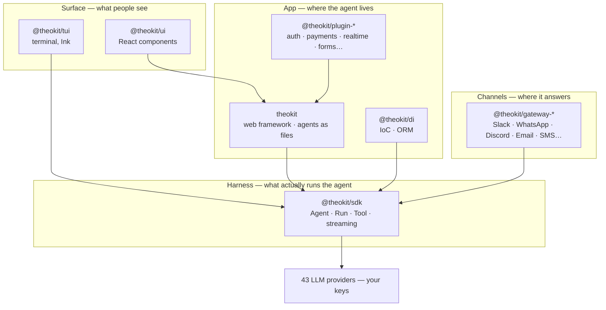

<div align="center">


# Theokit

### Chat. Build. Deploy.

**The open TypeScript stack where AI agents are first-class citizens.**

An agent is a file. It gets a route, a UI, a channel and a deploy target — and the runtime
underneath it is Apache-2.0, running on your own provider keys.

[](https://www.apache.org/licenses/LICENSE-2.0)
[](https://www.npmjs.com/package/theokit)
[](https://www.npmjs.com/package/@theokit/sdk)
[](https://github.com/usetheokit/theokit-sdk#configuration-reference)
[](https://nodejs.org)
[](https://discord.usetheo.dev/)

[usetheo.dev](https://usetheo.dev) · [Docs](https://usetheo.dev/docs) · [Discord](https://discord.usetheo.dev/) · [Good first issues](https://github.com/search?q=org%3Ausetheokit+is%3Aissue+is%3Aopen+label%3A%22good+first+issue%22&type=issues)

</div>

---

## Where to start

Four doors into the same stack. Take the one that matches what you are holding today.

| You want to… | Start with | First command |
| --- | --- | --- |
| Ship a **web app** with an agent inside it | [`theokit`](https://github.com/usetheokit/theokit) | `npx create-theokit my-app` |
| Run agents **from code you already have** | [`@theokit/sdk`](https://github.com/usetheokit/theokit-sdk) | `npm i @theokit/sdk` |
| Give an agent a **UI** — web or terminal | [`@theokit/ui`](https://github.com/usetheokit/theokit-ui) · [`@theokit/tui`](https://github.com/usetheokit/theokit-tui) | `npm i @theokit/ui` |
| Put an agent on **Slack, WhatsApp, Discord…** | [`theokit-gateways`](https://github.com/usetheokit/theokit-gateways) | `npm i @theokit/gateway-slack` |

### A full app, scaffolded

```bash
npx create-theokit my-app
cd my-app && pnpm dev
```

`agents/chat.ts` is served at `POST /api/agents/chat`. There is nothing to register — the file
*is* the route:

```ts
// agents/chat.ts
import { AgentBuilder } from '@theokit/agents'
import { z } from 'zod'

import { weatherTool } from './tools/weather.js'

export default AgentBuilder.create()
  .input(z.object({ message: z.string() }))
  .model('openai/gpt-4o-mini')
  .system('You are a helpful assistant.')
  .tool(weatherTool)
  // Human-in-the-loop: pause the run and ask before this tool executes.
  .approval('weather', { question: 'Look up the weather?' })
  .build()
```

The client binds by name and streams:

```tsx
import { useAgent } from 'theokit/client'

const { thread, send, status, reset, error } = useAgent<{ message: string }>('/api/agents/chat')
```

### Just the runtime

An agent over your working tree, streaming events as they arrive — no framework, no backend of
ours in the path:

```ts
import { Agent } from '@theokit/sdk'
import { assistantText } from '@theokit/sdk/messages'

const agent = await Agent.create({
  apiKey: process.env.THEOKIT_API_KEY!,
  model: { id: 'google/gemini-2.0-flash-001' },  // the provider is the prefix
  local: { cwd: process.cwd() },                 // this key selects the local runtime
})

const run = await agent.send('Summarize what this repository does')

for await (const event of run.stream()) {
  process.stdout.write(assistantText(event))
}
```

---

## Why this stack

Most agent SDKs ship open. Most agent **runtimes** don't — and the runtime is the part you cannot
replace on a bad day.

- **Apache-2.0 end to end.** The local harness runs agents to completion without a vendor in the
  loop. Walk-away cost is zero: fork it, keep your own provider keys, keep shipping.
- **43 LLM providers, your keys.** Anthropic, OpenAI, Google, and 40 more. The provider is a prefix
  on the model id, not a lock-in decision made at install time.
- **Sessions in native Claude Code `.jsonl`.** Point `local.sessionDir` at `~/.claude` and the
  Claude Code CLI can `--continue` a session your agent wrote.
- **The whole surface, not just the call.** Routing, auth, real-time, human-in-the-loop approvals,
  React and terminal components, eleven messaging channels — assembled, versioned together, and
  each usable on its own.
- **Dogfooded in public.** [usetheo.dev](https://usetheo.dev) — the marketing site, the docs and the
  docs assistant — is built with TheoKit. When the framework breaks, that site breaks first.

---

## The stack



Every arrow is a published npm dependency, never a workspace link. Each repository builds, tests
and releases on its own cadence — you can adopt one box and ignore the rest.

---

## Repositories

| Repository | What it is | npm |
| --- | --- | --- |
| **[theokit](https://github.com/usetheokit/theokit)** | The web framework. Routing, auth, real-time, deploy — wired. An agent is a file. | [](https://www.npmjs.com/package/theokit) |
| **[theokit-sdk](https://github.com/usetheokit/theokit-sdk)** | The Harness. `Agent.create` / `prompt` / `stream` / `resume`, MCP servers, subagents, memory, skills, cron. | [](https://www.npmjs.com/package/@theokit/sdk) |
| **[theokit-ui](https://github.com/usetheokit/theokit-ui)** | React components for agent surfaces — threads, tool calls, cost meters, permission modals. Three runtime themes, shadcn-compatible registry. | [](https://www.npmjs.com/package/@theokit/ui) |
| **[theokit-tui](https://github.com/usetheokit/theokit-tui)** | The same idea for the terminal, on Ink — streaming chat, tool-call cards, diffs, token and cost metrics. | [](https://www.npmjs.com/package/@theokit/tui) |
| **[theokit-gateways](https://github.com/usetheokit/theokit-gateways)** | Eleven channel adapters over one transport-agnostic core: Telegram, Discord, Slack, WhatsApp, Teams, Email, SMS, LINE, Matrix, Mattermost. | [](https://www.npmjs.com/package/@theokit/gateway) |
| **[theokit-plugins](https://github.com/usetheokit/theokit-plugins)** | First-party framework plugins — three auth providers plus canvas, copilot, realtime, drizzle, email, forms, payments, voice. | — |
| **[theokit-di](https://github.com/usetheokit/theokit-di)** | A NestJS-flavoured IoC container, agent-aware DI, and a repository-pattern ORM over drizzle. Optional DX layer. | [](https://www.npmjs.com/package/@theokit/di) |
| **[theokit-skill](https://github.com/usetheokit/theokit-skill)** | A Claude Code plugin that teaches the assistant the real SDK surface, so it writes correct code instead of plausible code. | [](https://www.npmjs.com/package/@theokit/skill) |

---

## Contributing

Newcomers are the reason the labels exist, and the fastest paths in are already tagged:

- 🌱 **[Good first issues](https://github.com/search?q=org%3Ausetheokit+is%3Aissue+is%3Aopen+label%3A%22good+first+issue%22&type=issues)** — scoped, reviewed, and safe to land in an afternoon.
- 🙋 **[Help wanted](https://github.com/search?q=org%3Ausetheokit+is%3Aissue+is%3Aopen+label%3A%22help+wanted%22&type=issues)** — bigger pieces we would rather not build alone.
- 🐛 **Found a bug?** Open it in the repository that owns the code — a reproduction beats a description.
- 📚 **Docs count.** A paragraph that unblocked you will unblock the next person too.

### How a change lands

```
workspace ──PR──> develop ──PR + semver tag──> main
 (all work)      (integration)                 (release)
```

Everything commits to `workspace` — features, fixes, docs, chores alike. We don't open a branch per
task. `develop` only advances through a pull request, and `main` receives release merges and
nothing else.

### The gates

One command tells you whether CI will be green, and each repository's `CONTRIBUTING.md` spells out
its own:

```bash
pnpm install
pnpm validate     # build + typecheck + test + lint + quality gates
```

The rule behind every gate is the same: **fix the code, not the threshold.** Tests come first — a
bug fix ships with the regression test that failed before it. Beyond lint, types and tests, the
gates refuse unreachable exports, import cycles, dependencies pointing the wrong way, and source
files past their size budget.

Read `CONTRIBUTING.md` in the repository you're touching before the first commit. Security
problems go through `SECURITY.md`, never a public issue. Every repository ships a Code of Conduct
and we enforce it.

---

## Status

Honest, because you're deciding whether to build on this:

- **`@theokit/sdk`** — the most mature piece, and the one everything else sits on.
- **`theokit`** — beta. The API is settling; breaking changes still happen, and they land in the changelog.
- **`@theokit/ui`**, **`@theokit/tui`**, **gateways**, **plugins**, **di** — published and usable, moving fast.
- **TheoCloud** (managed deploy) and **Studio** (local agent-building UI) — pre-release. Nothing in the local stack depends on either.

Versions are semver, changelogs are written for the people consuming the change, and every
published package is Apache-2.0.

---

<div align="center">

**[usetheo.dev](https://usetheo.dev)** · **[Discord](https://discord.usetheo.dev/)** · **[npm](https://www.npmjs.com/search?q=%40theokit)**

Apache-2.0 — © 2026 usetheo.dev

</div>
