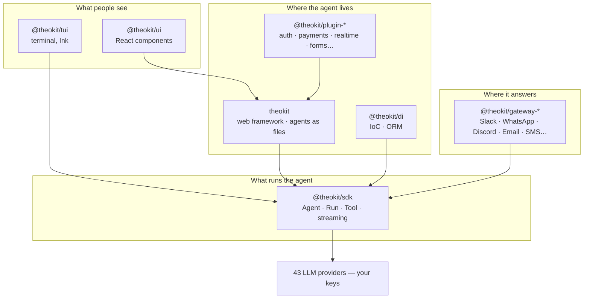

<div align="center">


[](https://www.apache.org/licenses/LICENSE-2.0)
[](https://www.npmjs.com/package/theokit)
[](https://www.npmjs.com/package/@theokit/sdk)
[](https://www.npmjs.com/package/@theokit/sdk)
[](https://github.com/usetheokit/theokit-sdk#configuration-reference)
[](https://discord.usetheo.dev/)

**Ship the agent this afternoon. Own the runtime forever.**

[usetheo.dev](https://usetheo.dev) · [Docs](https://usetheo.dev/docs) · [Discord](https://discord.usetheo.dev/) · [Good first issues](https://github.com/search?q=org%3Ausetheokit+is%3Aissue+is%3Aopen+label%3A%22good+first+issue%22&type=issues)

</div>

---

## Here is the whole thing

This is a complete agent endpoint. Not the interesting part of one — the file, entire:

```ts
// agents/support.ts
import { AgentBuilder } from '@theokit/agents'
import { z } from 'zod'

import { refundTool } from './tools/refund.js'

export default AgentBuilder.create()
  .input(z.object({ message: z.string() }))
  .model('openai/gpt-4o-mini')
  .system('You are the support agent for an online store.')
  .tool(refundTool)
  .approval('refund', { question: 'Issue this refund?' })
  .build()
```

Save it. It is live at `POST /api/agents/support`.

Nothing was registered. No router was touched, no server file edited, no config updated. And the
front end binds by the same name:

```tsx
const { thread, send, status } = useAgent<{ message: string }>('/api/agents/support')
```

That `.approval('refund', …)` line is the part people usually rebuild for a week. The run pauses
before the tool fires, the question reaches the UI, and it resumes on a human answer — the whole
loop, from one line.

```bash
npx create-theokit my-app
```

**That is the aha.** An agent is a file. Everything below is what happens once you believe it.

---

## What you didn't write

The list of things that already work, because the framework owns them and not you:

| The thing | Who writes it |
| --- | --- |
| The route for every agent | **Nobody.** The file's path is the route |
| Token streaming, browser to model | **Nobody.** `useAgent` is already streaming |
| Pause, ask a human, resume | One line: `.approval(…)` |
| Input validation, typed end to end | Your Zod schema — one definition, server and client |
| Auth, sessions, OAuth, magic links | Framework primitives and `@theokit/auth-*` |
| WebSockets, cron, webhooks | `defineWebSocket`, `defineCron`, `defineWebhook` |
| The chat UI itself | `@theokit/ui` — a themeable component library with a shadcn-compatible registry |
| Slack, WhatsApp, Discord, email, SMS | A gateway package each, eleven of them |

You write the system prompt, the tools, and your product. That was always the interesting part.

---

## Pick your door

| You have | Start here | First command |
| --- | --- | --- |
| An idea and an empty folder | [`theokit`](https://github.com/usetheokit/theokit) | `npx create-theokit my-app` |
| A codebase that needs an agent in it | [`@theokit/sdk`](https://github.com/usetheokit/theokit-sdk) | `npm i @theokit/sdk` |
| An agent with no face | [`@theokit/ui`](https://github.com/usetheokit/theokit-ui) · [`@theokit/tui`](https://github.com/usetheokit/theokit-tui) | `npm i @theokit/ui` |
| Users who live in Slack, not in your app | [`theokit-gateways`](https://github.com/usetheokit/theokit-gateways) | `npm i @theokit/gateway-slack` |

Just the runtime, no framework, nothing of ours in the request path:

```ts
import { Agent } from '@theokit/sdk'
import { assistantText } from '@theokit/sdk/messages'

const agent = await Agent.create({
  apiKey: process.env.THEOKIT_API_KEY!,
  model: { id: 'google/gemini-2.0-flash-001' },  // the provider is the prefix
  local: { cwd: process.cwd() },                 // this key selects the local runtime
})

const run = await agent.send('Summarize what this repository does')

for await (const event of run.stream()) {
  process.stdout.write(assistantText(event))
}
```

Forty-three providers behind that model id. Swap `google/…` for `anthropic/…` and the code above
does not change.

---

## The part nobody asks until month six

**What happens the day you want out?**

Ask it about the agent stack you are using right now. Most SDKs are open and their runtime is not,
which means the thing that actually executes your agent belongs to a vendor. Your exit is a rewrite.

Here the local runtime is Apache-2.0 and runs end to end on your machine, on your provider keys.
Fork it and every agent you wrote keeps running — no license call, no hosted backend, no notice
period. Sessions are written as native Claude Code `.jsonl`, so a session your agent produced can
be reopened with `claude --continue` in a tool we do not own.

The managed cloud is a convenience you can switch on. Nothing depends on it, and the price of
walking away is a `git clone`.

| Layer | Theokit | Typical closed-runtime stack |
| --- | --- | --- |
| SDK source | Apache-2.0 | Usually open — table stakes |
| **The runtime that executes your agent** | **Apache-2.0, runs locally, yours** | Proprietary, vendor-hosted |
| LLM provider | 43, your keys | Usually one, theirs |
| Session format | Native Claude Code `.jsonl` | A store you cannot open elsewhere |
| Cost of leaving | A fork | A rewrite |

---

## How the pieces fit



Every arrow is a published npm dependency, never a workspace link. Take one box, ignore the rest,
and nothing breaks.

---

## The repositories

| Repository | What it is | npm |
| --- | --- | --- |
| **[theokit](https://github.com/usetheokit/theokit)** | The web framework. Routing, auth, real-time, deploy — already wired. An agent is a file. | [](https://www.npmjs.com/package/theokit) |
| **[theokit-sdk](https://github.com/usetheokit/theokit-sdk)** | The runtime. `Agent.create` / `prompt` / `stream` / `resume`, MCP servers, subagents, memory, skills, cron. | [](https://www.npmjs.com/package/@theokit/sdk) |
| **[theokit-ui](https://github.com/usetheokit/theokit-ui)** | The agent surface in React — threads, tool calls, cost meters, permission modals. Three runtime themes, shadcn-compatible registry. | [](https://www.npmjs.com/package/@theokit/ui) |
| **[theokit-tui](https://github.com/usetheokit/theokit-tui)** | The same, for the terminal, on Ink. Streaming chat, tool-call cards, diffs, token and cost metrics. | [](https://www.npmjs.com/package/@theokit/tui) |
| **[theokit-gateways](https://github.com/usetheokit/theokit-gateways)** | Eleven channels over one core: Telegram, Discord, Slack, WhatsApp, Teams, Email, SMS, LINE, Matrix, Mattermost. | [](https://www.npmjs.com/package/@theokit/gateway) |
| **[theokit-plugins](https://github.com/usetheokit/theokit-plugins)** | First-party plugins — three auth providers plus canvas, copilot, realtime, drizzle, email, forms, payments, voice. | — |
| **[theokit-di](https://github.com/usetheokit/theokit-di)** | A NestJS-flavoured IoC container, agent-aware DI, and a repository-pattern ORM over drizzle. Optional. | [](https://www.npmjs.com/package/@theokit/di) |
| **[theokit-skill](https://github.com/usetheokit/theokit-skill)** | Teaches Claude Code the real SDK surface, so it writes correct code instead of plausible code. | [](https://www.npmjs.com/package/@theokit/skill) |

---

## Come build it with us

The stack is young enough that one good PR still changes its shape. Nothing here is settled by a
committee you cannot join.

- 🌱 **[Good first issues](https://github.com/search?q=org%3Ausetheokit+is%3Aissue+is%3Aopen+label%3A%22good+first+issue%22&type=issues)** — scoped, reviewed, landable in an afternoon.
- 🙋 **[Help wanted](https://github.com/search?q=org%3Ausetheokit+is%3Aissue+is%3Aopen+label%3A%22help+wanted%22&type=issues)** — the bigger pieces we would rather not build alone.
- 🐛 **A reproduction is a contribution.** Attach one to an open bug and you have already done the hard part.
- 📚 **Docs count double.** The paragraph that unblocked you will unblock the next person.

```
workspace ──PR──> develop ──PR + semver tag──> main
```

Everything commits to `workspace`. One command tells you whether CI will be green:

```bash
pnpm install && pnpm validate     # build + typecheck + test + lint + quality gates
```

The gates refuse a failing test, an import cycle, a dead export, a dependency pointing the wrong
way. The rule behind all of them: **fix the code, not the threshold.** Read the `CONTRIBUTING.md` of
the repository you are touching, and send security problems through `SECURITY.md` rather than a
public issue.

---

## Where this actually stands

You are deciding whether to build on this, so read it straight:

- **`@theokit/sdk`** is the mature piece. Everything else sits on it, and it is the most used package we ship.
- **`theokit`** is beta. The API is settling, breaking changes still happen, and every one lands in the changelog.
- **`@theokit/ui`, `@theokit/tui`, gateways, plugins, di** are published and moving fast.
- **TheoCloud** (managed deploy) and **Studio** (local agent builder) are pre-release. Nothing in the local stack depends on either.
- The docs and the site at **usetheo.dev** are built with TheoKit. When the framework breaks, that site breaks first, and we hear about it before you do.

Semver, changelogs written for the person consuming the change, Apache-2.0 on everything published.

<div align="center">

### `npx create-theokit my-app`

**[usetheo.dev](https://usetheo.dev)** · **[Discord](https://discord.usetheo.dev/)** · **[npm](https://www.npmjs.com/search?q=%40theokit)**

Apache-2.0 — © 2026 usetheo.dev

</div>
